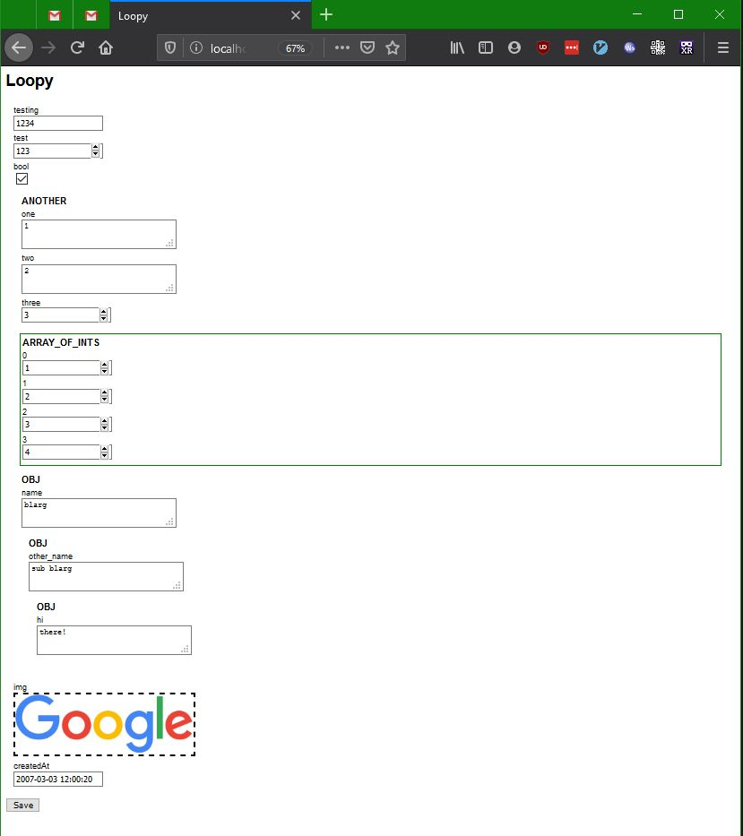

# Loopy

Loopy is a library to visually edit JSON objects. It guesses at the data type of the JSON property, and shows a property viewer / editor.  See src/main.js for an example.

I wrote it about 6 years ago (~2014), and never wound up using it. I am putting it up here for posterity. An example usage:

## Getting Started

I've updated the code to use parcel so getting it working should be pretty straightforward.

## License

MIT
